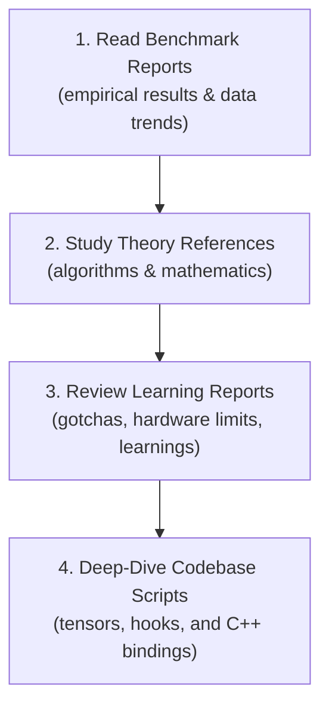

# LLM Inference Optimization Lab

This repository compiles research, empirical benchmarks, and optimization profiling for Large Language Model (LLM) inference on consumer-grade hardware. The primary objective is to investigate hardware-level bottlenecks and evaluate serving optimizations (including quantization, GPU offloading, KV cache pruning, PagedAttention/prefix caching, and speculative decoding) on resource-constrained devices.

---

## 1. Hardware Profile & Constraints

Experiments are conducted on a standard developer laptop configuration, representing local inference constraints rather than server-grade environments:

| Component | Specification |
| :--- | :--- |
| **CPU** | Intel Core i5 (12th Generation) |
| **System RAM** | 16 GB DDR5 |
| **GPU** | NVIDIA GeForce RTX 3050 Laptop GPU |
| **Physical VRAM** | 6 GB |
| **Operating System** | Windows |
| **Inference Backends** | `llama.cpp` (GGUF) / `PyTorch` (bitsandbytes) |

### Memory Constraints
With only **6 GB of physical VRAM**, the system represents a memory-bound residency cliff. Techniques like speculative decoding and long-context KV caching must be highly optimized to fit within on-device parameters and prevent slow unified memory CPU page swapping or Out-Of-Memory (OOM) failures.

---

## 2. Onboarding & Recommended Study Guide

If you are cloning this repository for the first time, we recommend a **top-down study path** to map high-level experimental observations back to codebase logic:



### Study Cycle for Key Optimization Areas:
For each optimization domain, follow this sequence:
* **Quantization & GPU Residency**:
  * Benchmark: [benchmarks/15-06-2026-quantization-benchmark.md](benchmarks/15-06-2026-quantization-benchmark.md)
  * Theory: [docs/quantization.md](docs/quantization.md)
  * Learnings: [learnings/learning-quantization-differences.md](learnings/learning-quantization-differences.md), [learnings/learning-hardware-setup.md](learnings/learning-hardware-setup.md)
* **KV Cache Math**:
  * Benchmark: [benchmarks/23-06-2026-kv-cache-profiler.md](benchmarks/23-06-2026-kv-cache-profiler.md)
  * Theory: [docs/kv-cache.md](docs/kv-cache.md)
  * Learnings: [learnings/learning-kv-cache-math.md](learnings/learning-kv-cache-math.md), [learnings/learning-transformer-internals.md](learnings/learning-transformer-internals.md)
* **FlashAttention (Memory IO vs. Compute)**:
  * Benchmark: [benchmarks/25-06-2026-flash-attention-benchmark.md](benchmarks/25-06-2026-flash-attention-benchmark.md)
  * Theory: [docs/flash-attention.md](docs/flash-attention.md)
  * Learnings: [learnings/learning-flashattention-memory-io.md](learnings/learning-flashattention-memory-io.md)
* **SnapKV Cache Compaction**:
  * Benchmark: [benchmarks/26-06-2026-snapkv-compression.md](benchmarks/26-06-2026-snapkv-compression.md)
  * Theory: [docs/snapkv.md](docs/snapkv.md)
  * Learnings: [learnings/learning-snapkv-mechanics.md](learnings/learning-snapkv-mechanics.md)
* **PagedAttention & Prefix Caching**:
  * Benchmark: [benchmarks/27-06-2026-paged-attention-benchmark.md](benchmarks/27-06-2026-paged-attention-benchmark.md)
  * Theory: [docs/kv-cache.md#5-pagedattention-memory-address-mapping-and-scheduling](docs/kv-cache.md#5-pagedattention-memory-address-mapping-and-scheduling)
  * Learnings: [learnings/learning-kv-cache-math.md#4-advanced-strategies-to-optimize-kv-cache-overhead](learnings/learning-kv-cache-math.md#4-advanced-strategies-to-optimize-kv-cache-overhead)
* **Native Speculative Decoding**:
  * Benchmark: [benchmarks/28-06-2026-speculative-decoding.md](benchmarks/28-06-2026-speculative-decoding.md)
  * Theory: [docs/speculative-decoding.md](docs/speculative-decoding.md)
  * Learnings: [learnings/learning-speculative-decoding-constraints.md](learnings/learning-speculative-decoding-constraints.md)

---

## 3. Project Structure

```text
llm-inference-lab/
│
├── benchmark.py                    # Main baseline CLI benchmark runner
├── kv_cache_profiler.py            # KV Cache memory growth profiler
├── paged_attention_profiler.py     # Prompt sharing / prefix caching sweeps
├── speculative_decoding_profiler.py # Speculative decoding sweeps (0.5B vs 1.5B)
├── requirements.txt                # Package dependencies
├── ideas_for_future_experiments.md # Month 5 research ideas and proposals
├── README.md                       # This file
│
├── snapkv/                         # PyTorch SnapKV implementation
│   ├── hook.py                     # Attention forward patching hooks
│   └── snapkv_evaluator.py         # Perplexity & memory sweeps (bitsandbytes)
│
├── benchmarks/                     # Empirical benchmark reports
│   ├── 12-06-2026-baseline-benchmark.md
│   ├── 15-06-2026-quantization-benchmark.md
│   ├── 23-06-2026-kv-cache-profiler.md
│   ├── 25-06-2026-flash-attention-benchmark.md
│   ├── 26-06-2026-snapkv-compression.md
│   ├── 27-06-2026-paged-attention-benchmark.md
│   └── 28-06-2026-speculative-decoding.md
│
├── docs/                           # Conceptual theory references
│   ├── transformer-basics.md
│   ├── kv-cache.md
│   ├── flash-attention.md
│   ├── snapkv.md
│   ├── speculative-decoding.md
│   └── tasklist.md                 # Complete curriculum task list
│
├── learnings/                      # Post-mortems and lessons learned
│   ├── learning-hardware-setup.md
│   ├── learning-kv-cache-math.md
│   ├── learning-snapkv-mechanics.md
│   └── learning-speculative-decoding-constraints.md
│
├── prompts/                        # System evaluation prompt files
│   ├── short.txt
│   ├── medium.txt
│   └── long.txt
│
└── results/                        # Saved CSV databases and JSON reports
    ├── benchmark_history.csv
    ├── snapkv_benchmark.csv
    ├── speculative_decoding_benchmark.csv
    └── json/
```

---

## 4. Setup & Installation

### 1. Initialize Virtual Environment
Initialize a local Python 3.12 virtual environment:
```powershell
uv venv --python C:\Users\adars\AppData\Local\Programs\Python\Python312\python.exe
.venv\Scripts\Activate.ps1
```

### 2. Compile `llama-cpp-python` with CUDA Support (Windows)
Configure Windows compile variables for CUDA compilation support:
```powershell
$env:CUDA_PATH = "C:\Program Files\NVIDIA GPU Computing Toolkit\CUDA\v13.3"
$env:CudaToolkitDir = "C:\Program Files\NVIDIA GPU Computing Toolkit\CUDA\v13.3"
$env:CMAKE_ARGS = "-DGGML_CUDA=on -DCMAKE_CUDA_COMPILER='C:/Program Files/NVIDIA GPU Computing Toolkit/CUDA/v13.3/bin/nvcc.exe'"
$env:PATH = "C:\Program Files\NVIDIA GPU Computing Toolkit\CUDA\v13.3\bin\x64;C:\Program Files (x86)\Microsoft Visual Studio\2022\BuildTools\VC\Tools\MSVC\14.44.35207\bin\Hostx64\x64;" + $env:PATH

uv pip install -r requirements.txt --no-binary llama-cpp-python --no-cache
```

---

## 5. Execution Reference Guide

Always ensure the CUDA DLL directory is present on your Windows environment path when running commands:
```powershell
$env:PATH = "C:\Program Files\NVIDIA GPU Computing Toolkit\CUDA\v13.3\bin\x64;" + $env:PATH
```

### 1. Baseline Performance Profiler
Runs latency, throughput, and telemetry profiling for specific GGUF models:
```powershell
python benchmark.py `
  --model C:\Users\adars\Downloads\qwen2.5-7b-instruct-q4_k_m-00001-of-00002.gguf `
  --quant Q4_K_M `
  --prompt prompts/medium.txt `
  --ngl 33 `
  --iterations 5
```

### 2. KV Cache Growth Profiler
Tracks VRAM consumption across context sizes:
```powershell
python kv_cache_profiler.py
```

### 3. PagedAttention Prompt Caching Sweeps
Profiles prefix matching speedups and memory layouts:
```powershell
python paged_attention_profiler.py
```

### 4. Speculative Decoding Sweeps
Profiles native speculative decoding speedups using a draft model:
```powershell
python speculative_decoding_profiler.py
```

### 5. SnapKV Perplexity and Memory Sweeps
Runs attention-pooling sweeps using actual Float16/Int8 weight loading:
```powershell
python snapkv/snapkv_evaluator.py --model "C:\Users\adars\Downloads\Qwen2.5-7B-Instruct"
```

---

## 6. Data Exporters & Schema

Summary database results are written to `results/*.csv` and per-run logs are exported to `results/json/`. The schema for the baseline run tracking includes:

| Column Name | Description |
| :--- | :--- |
| `run_id` | Unique ID generated per benchmark session |
| `iteration_index` | 1-based index representing the repetition run |
| `timestamp` | Date and time in `YYYY-MM-DDTHH:MM:SS` format |
| `model` | Name of the evaluated model file |
| `quantization` | Quantization type (e.g. `Q4_K_M`, `Int8`, `NF4`) |
| `n_gpu_layers` | Layers offloaded to the GPU |
| `prompt_tokens` | Exact count of tokens in prompt |
| `generated_tokens` | Exact count of tokens generated |
| `prompt_tps` | Prompt evaluation throughput (tokens/sec) |
| `generation_tps` | Generation throughput (tokens/sec) |
| `first_token_latency_ms` | Time to first token (TTFT) in ms |
| `peak_vram_mb` | Peak VRAM observed during generation |
| `avg_itl_ms` | Average Inter-Token Latency (ITL) in ms per token |
| `gpu_utilization` | Average GPU kernel execution % during generation |
| `gpu_power_watts` | Average GPU board power draw in Watts |
| `gpu_graphics_clock_mhz` | Average GPU Core clock speed in MHz |
